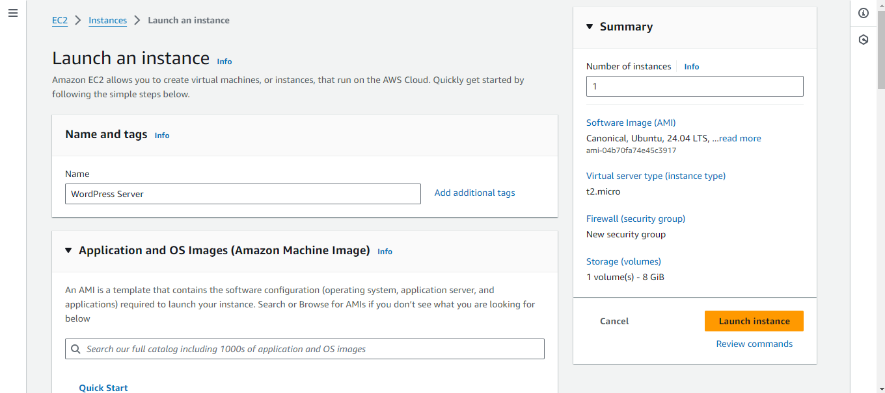
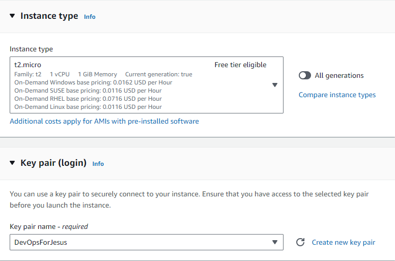
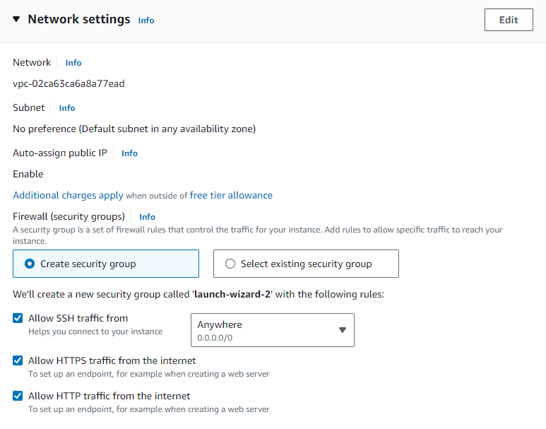

# Deploying WordPress to an Amazon EC2 Instance
## WordPress
WordPress is a web content management system. It was originally created as a tool to publish blogs but has evolved to support publishing other web content, including more traditional websites, mailing lists and Internet forum, media galleries, membership sites, learning management systems and online stores.

## Amazon EC2 Instance
Amazon Elastic Compute Cloud is a part of Amazon.com's cloud-computing platform, Amazon Web Services, that allows users to rent virtual computers on which to run their own computer applications.

### Step 1: Launch and configure an Amazon Linux or Red Hat Enterprise Linux Amazon EC2 instance

a. Sign in into your AWS Console and Click on EC2
b. Navigate to the EC2 Dashboard and Launch Instance
c. Choose the Server Name.


d. Choose the Amazon Machine Image.


e. Choose the Instance type and KeyPair


f. Configure the Network Settings


g. Configure Storage for the EC2 Instance


h. Then, Click on Launch Instance and the server should be running.


### Step 2: Connecting to the EC2 Instance
a. Click on your Public IPv4 address
b. I would be using a ssh-client called Mobaxterm to access my EC2 Instance
[Download Mobaxterm](https://mobaxterm.mobatek.net/download.html)

c. Login your EC2 Instance using:
- Ip Address
- Private Key (.pem)
- Server Name (Ubuntu)

### Step 3: Download Apache, PHP, MySQL.
1. Make sure your server is updated
```
sudo apt-get update

```

2. Install Apache server on Ubuntu
``` 
sudo apt install apache2 -y

```

3. Install php runtime and php mysql connector
```
sudo apt install php libapache2-mod-php php-mysql -y

```

4. Install MySQL server
```
sudo apt install mysql-server -y

```
### Step 4: Creating and Configuring MySQL Database
5. Login to MySQL server
```
sudo mysql -u root

```

6. Change authentication plugin to mysql_native_password (change the password to something strong)
```
ALTER USER 'root'@localhost IDENTIFIED WITH mysql_native_password BY 'Your Password';

```

7. Create a new database user for wordpress (change the password to something strong)
```
CREATE USER 'UserName'@localhost IDENTIFIED BY 'Password';

```

8. Create a database for wordpress
```
CREATE DATABASE wp;

```

9. Grant all privilges on the database 'wp' to the newly created user
```
GRANT ALL PRIVILEGES ON wp.* TO 'UserName'@localhost;

```
### Step 5: Download WordPress and configure it 
10. Download Wordpress
```
cd /tmp
wget [Lastest Wordpress version](https://wordpress.org/latest.tar.gz)

```

11. Unzip
```
tar -xvf latest.tar.gz

```

12. Move wordpress folder to apache document root
```
sudo mv wordpress/ /var/www/html

```

13. Command to restart/reload apache server
```
sudo systemctl restart apache2

```
OR
```
sudo systemctl reload apache2

```

14. Sign in the wordpress website using (http://ipaddress/wordpress/)

15. Login using the required credentials like password, username e.t.c

16. To configure the wp-config.php file
```
sudo vim wp-config.php

```
and paste this details

```
<?php
/**
 * The base configuration for WordPress
 *
 * The wp-config.php creation script uses this file during the installation.
 * You don't have to use the website, you can copy this file to "wp-config.php"
 * and fill in the values.
 *
 * This file contains the following configurations:
 *
 * * Database settings
 * * Secret keys
 * * Database table prefix
 * * ABSPATH
 *
 * @link https://wordpress.org/documentation/article/editing-wp-config-php/
 *
 * @package WordPress
 */

// ** Database settings - You can get this info from your web host ** //
/** The name of the database for WordPress */
define( 'DB_NAME', 'wp' );

/** Database username */
define( 'DB_USER', 'Promise' );

/** Database password */
define( 'DB_PASSWORD', 'Ironchest@567.' );

/** Database hostname */
define( 'DB_HOST', 'localhost' );

/** Database charset to use in creating database tables. */
define( 'DB_CHARSET', 'utf8mb4' );

/** The database collate type. Don't change this if in doubt. */
define( 'DB_COLLATE', '' );

/**#@+
 * Authentication unique keys and salts.
 *
 * Change these to different unique phrases! You can generate these using
 * the {@link https://api.wordpress.org/secret-key/1.1/salt/ WordPress.org secret-key service}.
 *
 * You can change these at any point in time to invalidate all existing cookies.
 * This will force all users to have to log in again.
 *
 * @since 2.6.0
 */
define( 'AUTH_KEY',         'J:<B|v6{Ydym?UN(..+GYskwi^-%<jH.zPw93t2$whwMcO!4 9mVx*^aOU?B0<*|' );
define( 'SECURE_AUTH_KEY',  ';oDzNS8F(-/@^=yR6./NqBx/I Z8XN6Hp+gPbqzsJi&g^SQ.erJ;S<!@6v:=b5h ' );
define( 'LOGGED_IN_KEY',    '}R_ZBLMA6ne]r:{{(`^Wf(rK!tT+dinPrTR-o7w`70yM@2O}A,#5SQ3mW(:shsRA' );
define( 'NONCE_KEY',        'ahzn/qc Y:xf|WFv}85F^FK`f0fDavBkPMB6#H4D./,`A,(7=E[6 vfR@1QPH%e)' );
define( 'AUTH_SALT',        '1:P7#@Mn#W-%GOp3I1=r$Sniexxl<j~o47?hS[OvSmvt+;pY]n6mI[-EElubdRt~' );
define( 'SECURE_AUTH_SALT', '_m-~ANQmdA}f?}ijpj4eT>0>3ubw<DQ[/q}V ;]+w,3-_^CWJj17&w=&[P96%L25' );
define( 'LOGGED_IN_SALT',   'w6!$E{5dt]#x:a1%;-@q`4U%G+6c; #8nfkk?sP&8g1~#cDIC1!*p,a*IhsvRePa' );
define( 'NONCE_SALT',       'ycZ&3_^|p:PV4I:xgG;LeM=4-r1Mf]fWr4aGeJ|ulTf<zwxsgf.*wQ-<RG9}O8V^' );

/**#@-*/

/**
 * WordPress database table prefix.
 *
 * You can have multiple installations in one database if you give each
 * a unique prefix. Only numbers, letters, and underscores please!
 */
$table_prefix = 'wp_';

/**
 * For developers: WordPress debugging mode.
 *
 * Change this to true to enable the display of notices during development.
 * It is strongly recommended that plugin and theme developers use WP_DEBUG
 * in their development environments.
 *
 * For information on other constants that can be used for debugging,
 * visit the documentation.
 *
 * @link https://wordpress.org/documentation/article/debugging-in-wordpress/
 */
define( 'WP_DEBUG', false );

/* Add any custom values between this line and the "stop editing" line. */


/* That's all, stop editing! Happy publishing. */

/** Absolute path to the WordPress directory. */
if ( ! defined( 'ABSPATH' ) ) {
	define( 'ABSPATH', __DIR__ . '/' );
}

/** Sets up WordPress vars and included files. */
require_once ABSPATH . 'wp-settings.php';


```
17. To configure WordPress to be access form the ipaddress rather than the ipaddress/wordpress
```
cd /etc/apache2/sites-available/
ls
sudo vim 000-default.conf

```

18. Edit the 000-default.conf file
```
DocumentRoot /var/www/html/wordpress

```

#### 18. Reboot apache to adopt new changes
```
sudo systemctl restart apache2

```

16. Install certbot
```
sudo apt-get update
sudo apt install certbot python3-certbot-apache

```


17. Request and install ssl on your site with certbot
```
sudo certbot --apache

```